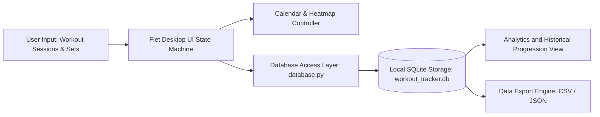

# aetherfit-workout-tracker

Desktop workout and fitness tracking application with calendar heatmaps, exercise progression analytics, and zero-latency local SQLite persistence.

## Overview

AetherFit Workout Tracker is a desktop productivity application engineered for tracking physical training regimens and progressive overload. It renders a dark-mode user interface using the Flutter-powered Flet framework, organizes workout logs and custom exercise routines into local relational SQLite storage, and provides visual calendar completion heatmaps with CSV/JSON export capabilities.

## Architecture and Pipeline

The application connects a client GUI to local state management through an immediate-mode persistence workflow.



- UI & Presentation: Built with Flet (Flutter engine for Python), delivering high-frame-rate desktop rendering with minimal system memory consumption.
- Data Modeling: Stores exercises, workouts, individual set repetitions, target weights, and completion notes in a local normalized SQLite schema.
- Calendar Aggregations: Pre-computes month-view workout completion flags to render visual status badges across training calendars.
- Portability: Operates completely offline without external network dependencies, accounts, or telemetry.

## Tech Stack

| Component | Technology | Description |
| :--- | :--- | :--- |
| Runtime | Python 3.10+ | Primary language environment |
| UI Framework | Flet (Flutter for Python) | Desktop native graphical user interface |
| Persistence | SQLite3 | Embedded transactional database engine |
| Export Formats | CSV, JSON | Standardized data export utilities |

## Project Structure

```text
Workout_Tracker/
├── .gitignore                # Git exclusion patterns
├── README.md                 # Technical documentation
├── requirements.txt          # Python package manifest
├── main.py                   # Flet application UI and event loop
├── database.py               # SQLite schema definitions and query methods
├── Run_Workout_Tracker.bat   # Windows quick-launch script
└── Launch_AetherFit.vbs      # Silent background startup wrapper
```

## Setup and Prerequisites

### Prerequisites
- Windows 10/11, macOS, or Linux
- Python 3.10 or higher

### Installation

1. Clone repository:
   ```bash
   git clone https://github.com/Gehrman-Sparrow42/Workout_Tracker.git
   cd Workout_Tracker
   ```

2. Configure virtual environment:
   ```bash
   python -m venv .venv
   .venv\Scripts\activate
   ```

3. Install dependencies:
   ```bash
   pip install -r requirements.txt
   ```

## Usage Examples

### Starting the Application
```bash
python main.py
```
Or execute the Windows launcher:
```bash
Run_Workout_Tracker.bat
```

## Notes and Constraints

- Offline Storage: All data is saved to `workout_tracker.db` in the application directory. Backing up or transferring this file preserves complete training history.
- Graphical Environment: Flet requires a running desktop display server (X11/Wayland on Linux, standard desktop on Windows/macOS).
